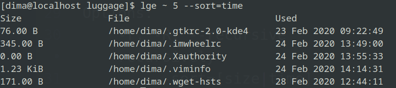

# Luggage 👜

Luggage(lge) its a simple cli tool. If you ever wants to know which files in your filesystem outdate this gem for you. Luggage finds less used files in choosen directory and sorts it by file size. After launch it prints report with some statics about file.


## Installation

Add this line to your application's Gemfile:

```ruby
gem 'luggage'
```

And then execute:

    $ bundle install

Or install it yourself as:

    $ gem install luggage

## Usage

``` shell
$ lge --help
Usage: lge [options] <path> <amount of files>

Options:
    -r, -R, --recursive              Search files recursively
        --sort=[size|time]           Sort output files with given param
    -h, --help                       Prints help
```

## Usage example

### With sort option:


### All available options:


## License

The gem is available as open source under the terms of the [MIT License](https://opensource.org/licenses/MIT).
